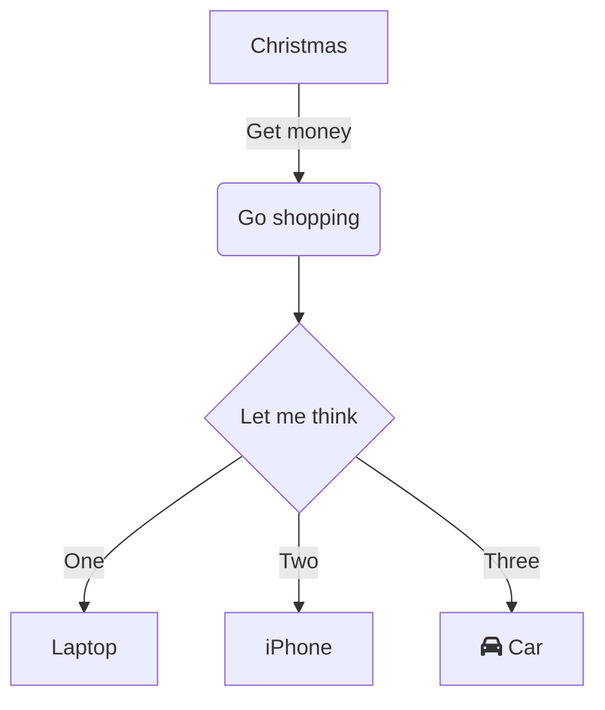

# Шпаргалка по Git

#### Инициализировать git

`git init`

#### Удалить папку с git

`rm -rf .git`

#### Показать состояние репозитория

`git status`

#### Добавить файлы для отслеживания

```
git add --all
git add .
git add text.txt
```

#### Добавить коммит

`git commit -m "Описание коммита"`

#### Посмотреть историю коммитов

`git log`

#### Добавить удаленный репозиторий

`git remote add origin адрес коммита`

#### Отправить изменения на удаленный репозиторий

```
// Первый раз
git push -u origin master

//Последующие разы
git push
```



